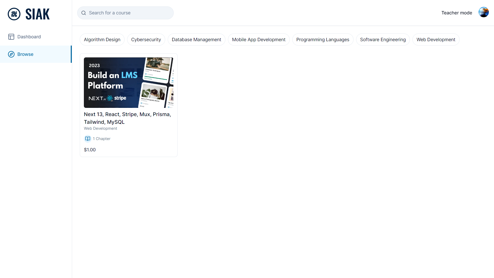

# Build an LMS Platform: Next.js 13,  React, Stripe, Mux, Prisma, Tailwind, MySQL | Full Course 2023



### Cloning the repository

```shell
git clone https://github.com/bintangnugrahaa/lms.git

```

### Install packages

```shell
npm install
```

### Setup .env file


```js
NEXT_PUBLIC_CLERK_PUBLISHABLE_KEY=
CLERK_SECRET_KEY=
NEXT_PUBLIC_CLERK_SIGN_IN_URL=
NEXT_PUBLIC_CLERK_SIGN_UP_URL=
NEXT_PUBLIC_CLERK_AFTER_SIGN_IN_URL=
NEXT_PUBLIC_CLERK_AFTER_SIGN_UP_URL=

DATABASE_URL=

UPLOADTHING_SECRET=
UPLOADTHING_APP_ID=

MUX_TOKEN_ID=
MUX_TOKEN_SECRET=

STRIPE_API_KEY=
NEXT_PUBLIC_APP_URL=http://localhost:3000
STRIPE_WEBHOOK_SECRET=

NEXT_PUBLIC_TEACHER_ID=
```

### Setup Prisma

Add MySQL Database (I used PlanetScale)

```shell
npx prisma generate
npx prisma db push

```

### Start the app

```shell
npm run dev
```
